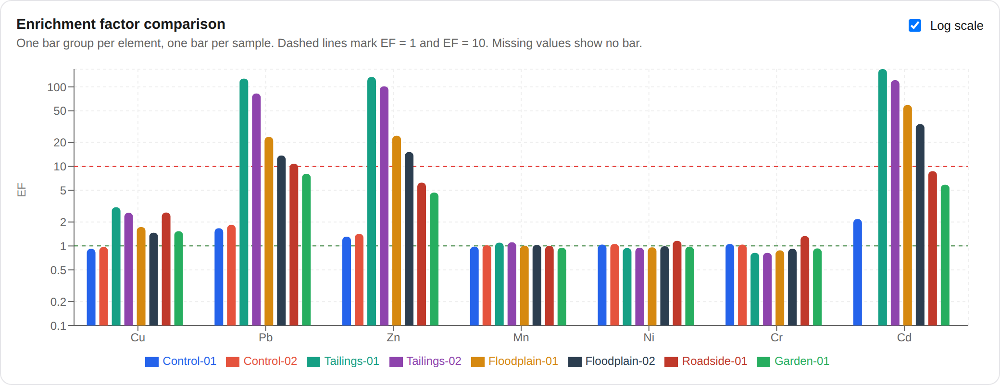

# Soil Heavy Metal Enrichment Factor (EF) Calculator

**[Live demo →](https://dhamsey3.github.io/ef-calculator/)**



An interactive tool for source-apportionment of trace/heavy metals in soils —
distinguishing **geogenic** (natural/crustal) from **anthropogenic**
(human-caused) contamination — using the Enrichment Factor method and the
Birch (2003) classification scheme.

Built as a companion tool for anyone doing contaminated-soil geochemistry
work (e.g. abandoned mine sites, industrial legacy soils), where calculating
and classifying EF values by hand across many samples/elements is tedious
and error-prone.

## What it does

- Enter raw elemental concentrations (µg/g) per sample
- Enter your own crustal/background reference concentrations
- Choose a reference (normalizing) element — typically Fe or Al
- Get EF per element per sample, automatically classified using Birch (2003)
  thresholds (no enrichment → extremely severe)
- Import samples from a CSV (comma-, semicolon- or tab-separated; a
  `Background` row fills the reference values), or download a template
- Compare samples/sites side by side on a bar chart, with an optional log
  scale for the wide range EF values cover
- Export all results to CSV
- Click any result to see the underlying calculation
- Try it instantly with **Load example** (illustrative placeholder numbers,
  not real data or a published baseline)
- Your inputs are saved in your browser, so a refresh doesn't lose them
  (nothing is uploaded anywhere)

### CSV import format

```csv
Sample,Fe,Cu,Pb,Zn
Background,,,,
Site A,,,,
```

First column is the sample name; other columns are element symbols
(`Cu`, `Cu (µg/g)` and `Cu_ppm` all work), with concentrations in µg/g.
Non-numeric cells such as `<LOD` are left blank.

To try it, download
[`example-soil-data.csv`](./public/example-soil-data.csv) — an illustrative
dataset (background row plus control, tailings, floodplain, roadside and
garden samples). The numbers are made up for demonstration; they are not
real field data or a published baseline.

## On reference/background values — read this before using real data

**This tool does not ship with built-in crustal reference values.** EF is a
ratio to a baseline, and that baseline is a scientific choice, not a
constant — it depends on your region, rock type, and which compilation you
trust. Plugging in numbers you haven't verified yourself defeats the purpose
of a "source apportionment" calculation.

Commonly cited sources for generic upper continental crust composition:

- Wedepohl, K.H. (1995). *The composition of the continental crust.*
  Geochimica et Cosmochimica Acta, 59(7), 1217–1232.
- Taylor, S.R. & McLennan, S.M. (1995). *The geochemical evolution of the
  continental crust.* Reviews of Geophysics, 33(2), 241–265.
- Rudnick, R.L. & Gao, S. (2003). *Composition of the Continental Crust.*
  Treatise on Geochemistry, 3, 1–64.

For a real study, a **local/regional background dataset** (uncontaminated
soils from a comparable geological setting near your study area) is
generally more defensible than a generic global crustal average — check
what your field/journal expects.

## The EF formula

```
EF = (Cx / Cref)_sample  ÷  (Cx / Cref)_crust
```

Where `Cx` is the concentration of the element of interest, and `Cref` is
the concentration of the reference element (e.g. Fe), in both the sample
and the crustal/background baseline.

## Birch (2003) classification

| EF range      | Interpretation          |
|---------------|--------------------------|
| ≤ 1           | No enrichment            |
| 1 – 3         | Minor enrichment         |
| 3 – 5         | Moderate enrichment      |
| 5 – 10        | Moderate–severe          |
| 10 – 25       | Severe enrichment        |
| 25 – 50       | Very severe              |
| > 50          | Extremely severe         |

Reference: Birch, G.F. (2003). *A scheme for assessing human impacts on
coastal aquatic environments using sediments.* In Coastal GIS: An Integrated
Approach to Australian Coastal Issues, Wollongong University Papers in
Center for Maritime Policy, 14.

## Running locally

```bash
npm install
npm run dev
```

Then open the local URL Vite prints (usually `http://localhost:5173`).

## Building for production

```bash
npm run build
```

Outputs a static site in `dist/` you can deploy anywhere (GitHub Pages,
Netlify, Vercel, S3, etc.).

## License

MIT — see [LICENSE](./LICENSE).
